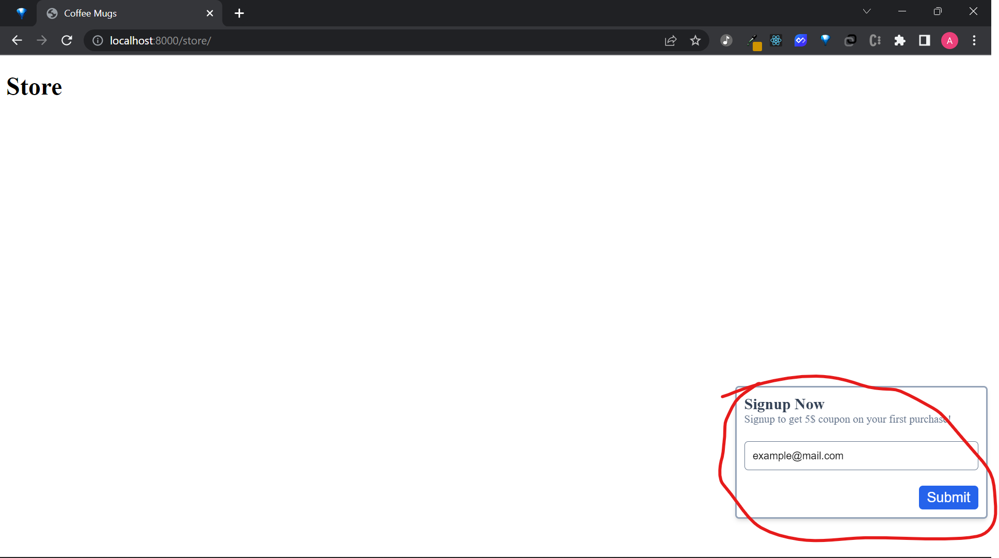
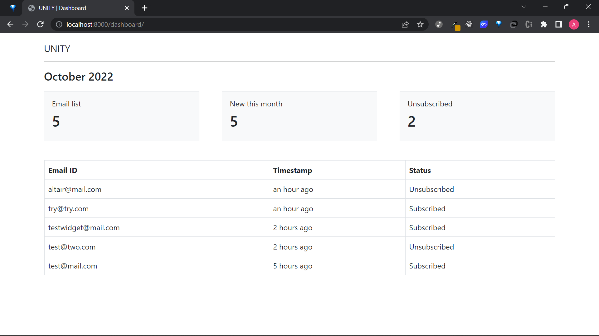
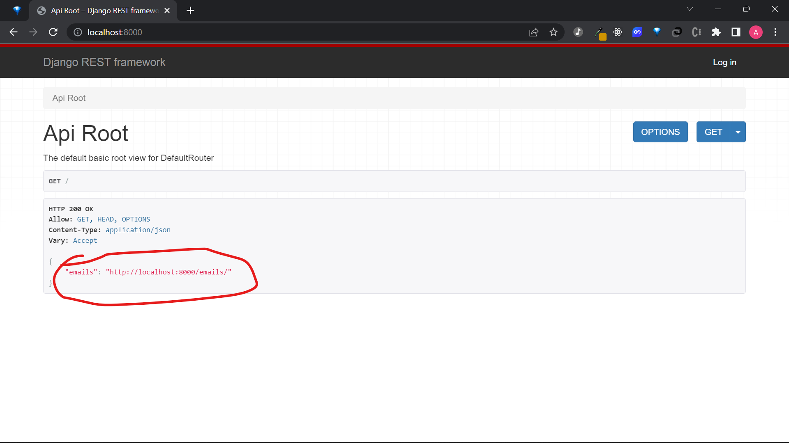
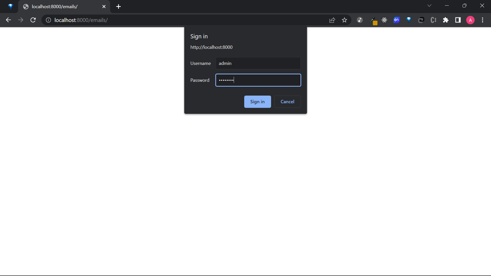
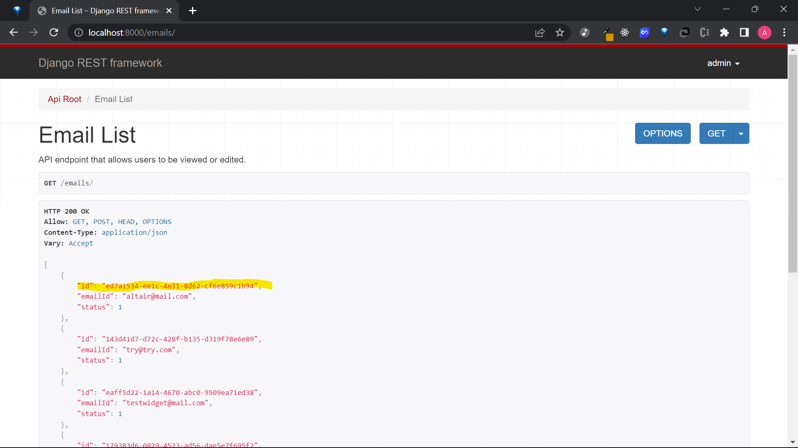
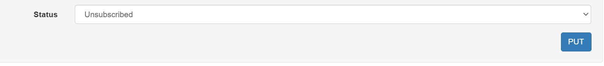

# Installation
1. Clone the repository
   ```sh
   git clone https://github.com/altairrostam/solution-fs-task.git
   ```
2. Open project folder
    ```sh
    cd solution-fs-task
    ```
3. Create a virtual environment
    ``` sh
    python3 -m venv env
    ```
4. Activate virtual environment
    ```sh
    source ./env/bin/activate 
    # On Windows use `env\Scripts\activate`
    ```
5. Install packages
    ```sh
    pip -r requirements.txt
    ```
6. Migrate database
    ```sh
    python manage.py migrate
    ```
7. Set up super user (to view admin site). Note: Email and username is arbitrary
    ```sh
     python manage.py createsuperuser --email admin@example.com --username admin
    ```
8. Collect static files
    ```sh
    python manage.py collectstatic
    ```
9. Run project
    ```sh
    python manage.py runserver
    ```
    The project will be live on http://localhost:8000
# Main sites
There are 4 main sites you can access : Dashboard, Store, Admin, and Browsable API site by Django Rest Framework

- Dashboard
    ```
    http://localhost:8000/dashboard
    ```
- Store
    ```
     http://localhost:8000/store
    ```
You can access the admin site by entering the username and password you've just created with the command from step 7 of installation section. The credentials also applies to the Browsable API site as well
- Admin

    ```
    http://localhost:8000/admin
    ```

- Browsable API

    ```
    http://localhost:8000
    ```

# Usage
## Main solution
To simulate the solution for this task, here are the steps you can take:
1. Open store site via ```http://localhost:8000/store```
2. On the widget section, type in the email on the form and click submit.


3. Open dashboard site via ```http://localhost:8000/dashboard``` .
Here you can view the newly subscribed email, along with other related statistics.

4. Refresh the dashboard site everytime a new data is submitted to view changes.

## Unsubscribing
To try unsubscribing and test whether the dashboard site reflected the changes, here are the steps you can take:
1. Open browsable site via ```http://localhost:8000```

2. Here the API Root View is being displayed. Click on the link showed in the picture below


3. You will be prompted to input your credentials. Login with the username and password you have created.


4. After logging in successfully, the page will display a list of emails that has been registered. Each email object will have its respective id, emailId, and status.

5. Copy the id from one of the email object you wish to change. The id is highlighted in yellow from the picture below.


6. We can access the email with the id we have chosen by access the url with this following format :  
    ```
    http://localhost:8000/emails/{id_of_email}
    ```
    Where {id_of_email} is the email id we have copied. In our example, the url is  ```http://localhost:8000/emails/ed7a1534-ee1c-4e31-8d62-cf6e859c1b94```

7. The page will display the detail of the email object we want to change. There will be a form on the bottom of the page to modify the data. Focus on the status dropdown, pick 'Unsubscribed' and click the 'PUT' button.


8. By now, the change in data should have been reflected. The status has change from '1' to '0'. Visit again the dashboard site to check whether the data has been modified or not.